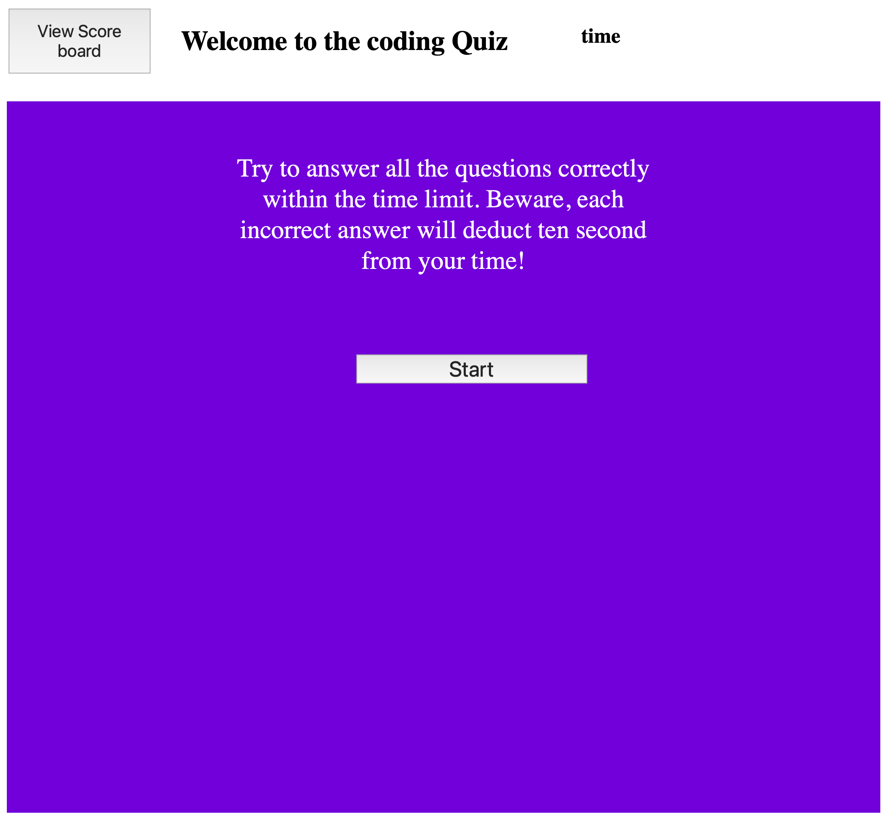

# code-quiz

## Description
The purpose of this project was to build a timed quiz with multiple choice questions powered javascript. Creating this project required an understanding of primarily javascript functions to have dynamically updated elements and the use of local storage in order to save multiple user scores.

## Installation

N/A

## Deployed Webpage

Deployed URL: https://koreycollazo.github.io/code-quiz/

## Credits

N/A

## License

N/A
